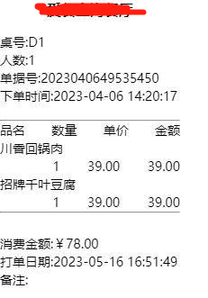

# electron-vite-app

使用 Electron + Vite 构建桌面应用
基于 Websocket 的自动打印小票插件

### 1 websocket 连接本地 12346 端口

```
new WebSocket("localhost:12346")
```

### 2 socket 发送 json 数据获取打印机列表

```
let msg = {
  method: "getprinterlist",
  description: "获取打印机列表",
}
socket.send(JSON.stringify(msg));
```

### 3 socket 发送 json 数据打印小票

```
let msg = {
  method: "printreport",
  description: "打印Pos小票",
  PrinterName: "当前选择的打印机名称",
  Preview: "0",
  data: {
  title: string; // 标题
  tableNum: string; // 桌号
  orderNum: string; // 订单编号
  createTime: string; // 创建时间
  allTotal: string; // 总价
  goodList: Array<{
    shopName: string; // 商品名称
    quantity: number; // 数量
    total: number; // 总价
    price: number; // 单价
  }>;
  num: number; // 商品总数
  content: string; // 备注
  }
  };

state.socket.send(JSON.stringify(msg));
```



## Recommended IDE Setup

- [VSCode](https://code.visualstudio.com/) + [ESLint](https://marketplace.visualstudio.com/items?itemName=dbaeumer.vscode-eslint) + [Prettier](https://marketplace.visualstudio.com/items?itemName=esbenp.prettier-vscode)

## Project Setup

### Install

```bash
$ npm install
```

### Development

```bash
$ npm run dev
```

### Build

```bash
# For windows
$ npm run build:win

# For macOS
$ npm run build:mac

# For Linux
$ npm run build:linux
```
